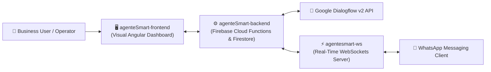

# 🖥️ AgenteSmart Frontend — No-Code Dialogflow Dashboard

[](https://angular.dev)
[](https://www.typescriptlang.org)
[](https://firebase.google.com)
[](LICENSE)

An intuitive **Angular Single Page Application & PWA** designed to give non-technical users a visual, No-Code interface to supervise, configure, and train **Google Dialogflow** conversational agents.

Part of the **AgenteSmart Full-Stack Suite**:
- 🖥️ [**`agenteSmart-frontend`**](https://github.com/jgu7man/agenteSmart-frontend) (Visual Angular Dashboard)
- ⚙️ [**`agenteSmart-backend`**](https://github.com/jgu7man/agenteSmart-backend) (Firebase Cloud Functions & Firestore API)
- ⚡ [**`agentesmart-ws`**](https://github.com/jgu7man/agentesmart-ws) (Real-Time WebSockets WhatsApp Bridge)

---

## 🏗️ Full-Stack Suite Topology



---

## ✨ Key Features

- 🎨 **Visual Intent & Entity Management:** Allows operators to review and edit conversational intents without opening the Google Cloud console.
- 💬 **Live Conversation Inspector:** Real-time visibility into active user chats and intent matching logs.
- 📱 **Progressive Web App (PWA):** Built with `@angular/pwa` and Service Workers for mobile-friendly operational access.
- 🔐 **Role-Based Authentication:** Integrated with Firebase Authentication and Firestore security rules.

---

## 🛠️ Local Development

```bash
# Install dependencies
npm install

# Run local development server
npm start
# Open http://localhost:4200
```

---

## 📄 License
Distributed under the [MIT License](LICENSE). Created by [Jorge Guzmán (@jgu7man)](https://github.com/jgu7man).
